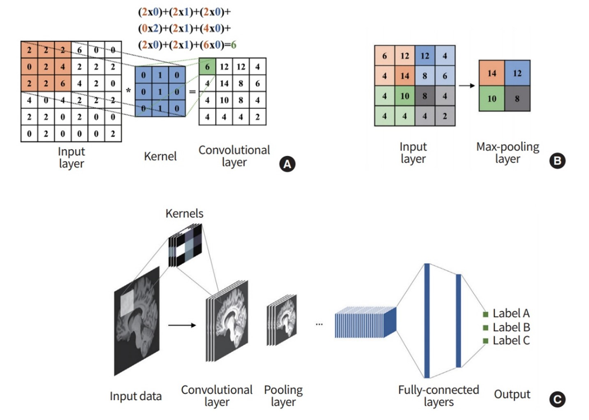

# Введение

В наше время наблюдается стремительный рост технологий с применением искусственного интеллекта, под которым часто подразумевают нейронные сети. Во многом это обусловлено тем, что нейронные сети, будучи симуляцией нейронов органического мозга, позволяют решать нетривиальные задачи, неподвластные человеку, например постановка диагноза по рентген снимку, предсказание курса акций на бирже, генерация изображений и т.д.

Ввиду востребованности данной технологии была выбрана тема «разработка системы диагностики артроза по рентген снимкам коленного сустава».

# Анализ предметной области

в данной главе осуществляется анализ предметной области, перечисляются существующие решения, а также ведётся обзор технологий для реализации сервиса.

**1.1 Анализ назначения программы**

В наше время нейросетевые технологии используются во множестве различных сфер, однако по большей части они решают задачи бизнеса, а разработок в области медицины на порядок меньше.

Сервис будет представлять из себя систему, способную распознавать степень артроза сустава по его рентген снимку.

Сервис будет реализовывать единственную функцию: загрузка рентген снимка сустава и мгновенный ответ с вероятностями степеней артроза.

**1.2. Обзор существующих решений**

На момент написания курсовой работы не было выявлено аналогов данной работы. Существуют предобученные нейронные сети, но они имеют определённые недостатки: имеют низкую точность и не позволяют понять, на основе чего нейросеть сделала тот или иной вывод.

**1.3. Анализ средств**

Сервис для распознавания степени артроза будет иметь в себе следующие компоненты:

- Ядро, представляющее из себя нейросеть;
- Веб-сервис, служащий обёрткой над нейросетью;

Были поставлены следующие задачи:

1. Изучить сервисы/технологии для разработки нейросетей;
2. Изучить подходы к разработке нейросетей;
3. Изучить сервисы, предоставляющие ресурсы для обучения нейросетей;

Выбрать источник данных для тренировки;

Выбрать веб-сервис для обертки над нейросетью;

Сформировать требования к продукту;

Спроектировать приложение.

**1.3.1. Сервисы для разработки нейросетей**

В данный момент в сфере нейросетей присутствуют три лидера: TensorFlow, PyTorch, Keras и XGBoost. После непродолжительного анализа был выбран фреймворк Keras ввиду того, что в нём присутствует возможность составлять нейросети высокоуровневыми блоками, что довольно удобно.

**1.3.2. Подходы к разработке нейросетей**

В процессе самообучения было выделено несколько различных подходов к разработке нейросетей, а именно:

1. Свёрточные (convolutional) нейронные сети;

Остаточные (residual) нейронные сети;

Рекуррентные (recurrent) нейронные сети.

Рассмотрим каждый из них поподробнее.

Свёрточные нейронные сети представляют из себя архитектуру нейронных сетей, при которой на вход нейронной сети подаётся определённое количество сигналов, которые сеть преобразует в некоторое количество feature maps. Feature map можно охарактеризовать как исходные данные с наложенным «фильтром». На рис. 1 сверху слева вы можете видеть вычисление feature map из исходных данных и сверточного ядра. Как мы можем видеть, это обыкновенное скалярное произведение входных данных со сверточным ядром с тем лишь нюансом, что скалярное вычисление вычисляется для каждой области входных данных. Это значит, что если мы условно обозначим на картинке первую область как \[0, 2;0, 2\], где 0,2 это координаты начала и конца области по вертикали и горизонтали соответственно, то также будут вычислены \[0, 2; 1, 3\], \[0, 2; 2, 4\], \[0, 2; 3, 5\], \[1, 3; 0, 2\] и так далее. Данный вид архитектуры высокоэффективен для нахождения повторяющихся закономерностей.

Рисунок 1 – Свёртка

Остаточные нейронные сети являются типом нейросетей, в которых имеются особые остаточные блоки, в которых могут быть, например, линейные или сверточные слои, которые так же обращаются ко входу остаточного блока. Происходит это посредством суммирования обработанного каким-либо слоём и необработанного входов блока. Вы можете увидеть примерную архитектуру такого блока на рисунке 2. Данный вид архитектуры эффективен тем, что теряется меньше информации в процессе преобразования данных, чем в линейной или сверточной нейросетях.

Рисунок 2 – Остаточная сеть

Рекуррентные нейронные сети – это вид нейронных сетей, имеющих долгую краткосрочную память (LSTM). Чаще всего эти нейросети используются в языковых моделях, так что разбирать их не имеет особого смысла.

Таким образом, для разработки были выбраны 2 основных подхода: свёрточные нейронные сети и остаточные нейронные сети.

**1.3.3. Сервисы для обучения нейросети**

Ввиду того, что обучение нейросети – довольно сложная задача в смысле компьютерных вычислений, необходимо было выбрать бесплатный сервис для обучения. Наиболее популярные – Google Colab, Kaggle, Microsoft Azure Notebook. Ввиду того, что из-за санкций последний вариант недоступен, пришлось пользоваться Colab и Kaggle. Colab довольно удобен с точки зрения разработки, поэтому изначально работа велась в нём, однако Kaggle предоставляет бóльшие ресурсы для тренировки нейросетей, потому дальнейшая разработка велась в Kaggle.

**1.3.4. Сервисы для обучения нейросети**

В качестве источника данных был выбран датасет на сайте Kaggle под названием [Knee Osteoarthritis Dataset with KL Grading - 2018](https://www.kaggle.com/datasets/tommyngx/kneeoa), представляющий из себя рентген снимки коленей (1 колено на 1 снимке) в формате 224 на 224 пикселя. Данные размечены на 5 классов: 1 – здоровое колено, 2 – колено с возможной патологией, 3 – колено с подтверждённой патологией первой степени, 4 – колено с множественными подтверждёнными патологиями средней тяжести, 5 – колено с множественными патологиями высокой тяжести. Вы можете увидеть легенду на рисунке 3.

Рисунок 3 – Легенда датасета

**1.3.5. Сервис-обёртка над нейросетью**

Для совместимости с ЕРИС необходимо, чтобы сервис был размещён в интернете, а для этого нужен веб-фреймворк. В качестве такого был выбран FastApi ввиду того, что это активно развивающийся и легкий фреймворк.

**1.4. Требования к проекту**

Были сформированы следующие требования к проекту:

1. Проект должен распознавать степень артроза сустава;
2. Проект должен возвращать области, в которых предположительно локализованы патологии;
3. Проект должен иметь понятный интерфейс.

# Проектирование

В этой главе будет производиться проектирование сервиса и его интерфейса.

**2.1 Общая информация**

Как уже было упомянуто выше, для сервиса будут использоваться keras, fastapi. Эти средства позволяют писать емкий читаемый код, и цель – написать не только рабочий прототип сервиса, но ещё и сделать его исходный код легко читаемым и поддерживаемым.

**2.2 Проектирование интерфейса пользователя**

Перед тем, чем приступить к работе, требовалось разработать или создать дизайн пользовательского интерфейса, который впоследствии будет воплощен в программе, являющейся результатом выполнения курсовой работы. Было принято решение проектировать макеты с использованием графического редактора под названием «Microsoft Paint», поскольку он отличается простотой и скоростью работы.

В конечном продукте, результате курсовой работы будет всего лишь один экран с двумя секциями. Проект должен выполнять лишь одну функцию, классифицировать рентген снимки, так что нет нужды верстать усложнённый интерфейс с большим количеством различных функций. Ниже – примерный эскиз будущего интерфейса.

Рисунок 4 – будущий интерфейс

# Реализация информационной системы

В данной главе будет описано получившееся приложение и его архитектура.

3.1. Архитектура **нейронной сети**

Для того, чтобы понять архитектуру получившейся нейронной сети, необходимо сначала рассмотреть блокнот, в котором велась разработка.

Листинг кода приведён в приложении А.

В данном блокноте можно выделить три основных блока: загрузка и препроцессинг (1-75), задание нейросетевой структуры (77-155), обучение (164-208). Рассмотрим каждый поподробнее.

**3.1.1. Препроцессинг**

В строке 23 мы можем увидеть изменение размерности изображения до 112\*112. Это нужно для того, чтобы уменьшить размерность сети с 224\*224 для ускорения обучения. Также в выбранном датасете довольно много снимков, и они не были нормализованы. У какого-то снимка был засвет, у какого-то – наборот, слишком тёмная цветовая гамма, также были и другие отклонения вроде стальных болтов в коленях, случайно попавших на снимки букв и т.п., но было решено исправлять только цветовые отклонения. Для этого был выбран метод эквализации гистограмм из пакета Opencv. На рисунке 5 можно увидеть принцип работы этого метода, его суть заключается в том, чтобы равномерно распределить распределение значений во всех каналах.

Рисунок 5 – Эквализация гистограм

Вы можете увидеть реализацию данного метода в строках с 23 по 35. Очень важно корректно осуществить препроцессинг и убедиться что данные принимают нужный вид, потому что в процессе разработки довольно долго существовала проблема того, что по непонятным причинам нейросеть выводила лишь одно значение. Оказалось, что это – следствие того, что при препроцессинге значения принимали вид \[0..255\], а не \[0..1\], вследствие чего при обратном проходе к весам применялись слишком высокие значения и нейросеть не имела возможности обучиться.

Пример препроцессинга вы можете видеть ниже, рисунок 6 – серия изображений до препроцессинга, рисунок 7 – после. На обоих снимках одни и те же фотографии.

Рисунок 6 – фото до обработки

Рисунок 7 – Фото после обработки

**3.1.2. Нейросетевая структура**

Тренировка нейросети и выбор подходящей для неё структуры – самый сложный и трудоёмкий этап во всей курсовой работе. Ранее уже говорилось о том, что будут использованы свёрточные и остаточные слои. Их можно увидеть в кастомном блоке под названием BigResidual в строке 77. Данный блок – очень важная архитектурная часть сети. Он вдохновлён Xception блоком в одноимённой неросети, разработанной компанией Google. Вы можете видеть архитектуру блока Xception на рисунке 8.

Рисунок 8 – блок Xception

Архитектура блока BigResidual похожа, но всё же имеет существенные различия. Так, данный блок представляет из себя остаточный блок, имеющий следующую структуру:

1. На вход подаются значения;
2. Эти значения обрабатываются свёрткой 3\*3, не меняя размерность;
3. Значения из пункта 2 активируются функцией LeakyReLu и к ним снова применяется свёртка 3\*3;
4. Значения из пункта 3 активируются функцией LeakyReLu и к ним снова применяется свёртка 3\*3;
5. Значения из пункта 4 активируются функцией LeakyReLu и к ним снова применяется свёртка 3\*3;
6. Складываются и нормализуются значения из пунктов 2, 3, 4, 5, затем к ним применяется функция активации и Dropout с значением 0.4.

Вы могли заметить, что в блоке используется leakyrelu, а не обычный ReLu. Это было сделано сознательно для того, чтобы нейроны нейросети, случайно отключённые в процессе обучения, могли восстановиться через большое количество итераций. Также в блоке используется Dropout, случайно выключающий 40% нейронов в процессе обучения чтобы избежать переобучения. Схему данного блока вы можете увидеть ниже.

Рисунок 9 – Блок BigResidual

В нейросети первый такой блок выступает автоэнкодером. Перейдём к обзору архитектуры сети в целом.

Сеть реализована с помощью Sequential класса, а значит, представляет из себя последовательность блоков. Для уменьшения размерности в ней используются слои MaxPooling, а для увеличения – свёртки 1\*1. Мы можем видеть, что форма ввода для нейросети – 112\*112\*3, это значит, что нейросеть принимает изображение 112\*112 пикселей в трёх каналах. Далее они проходят через три остаточных блока, а после этого найденные features прогоняются через линейные слои и на выходе мы имеем 3 вероятности с активацией softmax, что соответствует вероятности принадлежности к одному из классов. Полную архитектуру модели можно увидеть на рисунке 10.

Рисунок 10 – Архитектура нейросети

Всего в нейросети 20438945 параметров, из которых 704 не тренируемые, суммарным весом в 78мб.

Вероятностей принадлежности к одному из классов всего 3 из-за того, что данных очень мало, на рисунке ниже – результат выполнения анализа по количеству классов в тренировочных и тестовых значениях.

Рисунок 11 – Анализ данных

Как мы можем видеть, в среднем в тренировочных данных примерно 1156, больше всего данных – в первом классе (здоровые), и меньше всего – в последнем (очень болные). Так что сначала было принято решение классифицировать первые 3 класса, однако в дальнейшем было обнаружено, что 2 класс не поддаётся обнаружению (скорее всего он почти не отличается от первого или отличается незначительно) и было принято решение классифицировать первый, третий и четвертый классы.

Модель компилируется с помощью критерия потерь loss_sparse_categorical_crossentropy и оптимизатора Адам, по метрике accuracy. Выбор критерия потерь обусловлен тем, что это лучший из возможных критериев, так как он наиболее точно вычисляет потери для данной задачи классификации. Оптимизатор был выбран случайным образом, а метрика accuracy почти всегда используется при обучении.

**3.1.3. Обучение нейросети**

Как уже было сказано выше, в процессе разработки возникало очень много проблем, из-за которых нейросеть предсказывала лишь одно значение. Причин у этого было очень много: ненормализованный ввод, слишком высокий коэффицент обучения, неправильные классы.

Обучение производилось на двух видеокартах, на nvidia tesla t4 (google colab) и nvidia tesla p100 (Kaggle). Последняя зарекомендовала себя значительно лучше, позволяя с высокой скоростью обучать нейросеть.

Все значения для обучения нейросети были получены экспериментальным путём. Каждый раз после завершения обучения есть возможность сохранить веса, а также посмотреть график изменения потерь и точности с течением эпох. Ниже мы можем увидеть эти графики для финальной версии нейросети.

Рисунок 12 – Анализ точности модели

Рисунок 13 –Анализ функции потерь

Для сохранение весов была придумана нотация: {точность в процентах}-{краткое описание результата}-v{версия данной архитектуры}. Таким образом, 65-relative-success-v3.weights.h5 расшифровывается как третья версия модели, справившаяся с задачей с относительным успехом с точностью 65%.

**3.2. Архитектура проекта**

На финальной стадии разработки проект имеет следующую структуру:

- Модуль main – модуль, отвечающий за обработку http запросов;
- Модуль analyze – модуль, нужный для исследования данных. Не обязателен для использования в работе;
- Модуль debug – модуль, нужный для подсветки патологий. Данный модуль принимает на вход модель и изображение, поданное на вход и возвращает его в обработанном виде;
- Модуль model – самый главный модуль. Он загружает веса предобученной нейронной сети для классификации и возвращает модель, пригодную для использования;
- Модуль preprocess – модуль, представляющий из себя предобработчик рентген снимков. Он использовался для обучения нейронной сети, так что для корректной работы его лучше оставить;
- Модуль setup – модуль, загружающий с гугл диска веса для нейронной сети;
- Папки static и templates – папки с ресурсами: с статичными файлами и шаблонами соответственно.

Рассмотрим каждый модуль подробнее.

**3.2.1. Модуль main**

Данный модуль представляет из себя FastApi приложение с двумя эндпоинтами: ‘/’ и ‘/predict’. Первый эндпоинт возвращает пользователю обработанный html шаблон, второй возвращает json в формате {“payload”:\[вероятность отсутствия артрита, вероятность первой категории артрита, вероятность второй категории артрита\], “filenames”:\[путь до файла с подсветкой патологий\]}.

Рисунок 14 – Модуль main

Ниже – результат перехода по эндпоинту ‘/’.

Рисунок 15 – Результат первого эндпоинта

**3.2.2. Модуль analyze**

Модуль analyze был разработан для поверхностного анализа количества тренировочных и тестовых значений различных классов. Ниже – исходный код данного модуля, а также результат его выполнения.

Рисунок 16 – Модуль analyze

Рисунок 17 – вывод модуля

**3.2.3. Модуль debug**

Ниже – исходный код данного модуля.

Рисунок 18 – Модуль debug

На нём мы можем видеть аргументы model, img, debug, brightness основной функции. Они означают соответственно предобученную модель; изображение, поданное на вход в формате матрицы размерности (112, 112, 3); флаг для вывода всех features по отдельности; параметр яркости. Параметр яркости позволяет сильнее подсветить вывод нейросети.

Как мы можем видеть, для данной функции используется не базовая модель, а new_model, представляющая из себя обрезанную до второго BigResidual слоя (восьмого по счёту) основную модель. Мы обрезаем её так как нам нужны фильтры. После этого мы предсказываем features на обрезанной модели на заданном изображении, затем добавляем все features в массив images, раскрашиваем их в розовый цвет (для наглядности), суммируем (чтобы было легче накладывать на входное изображение) и в строках 35-36 сначала накладываем просумммированные картинки на исходную, затем обрезаем результат до значений \[0..255\] для корректного отображения.

**3.2.4. Модуль model**

Модуль model повторяет логику ipynb блокнота с тренировкой нейросети, а именно – часть её описания, так что описывать модуль не имеет смысла.

**3.2.5. Модуль preprocess**

Модуль preprocess повторяет логику работы ipynb блокнота с тренировкой нейросети, а именно – часть препроцессинга изображений, так что описывать модуль не имеет смысла.

**3.2.6. Модуль setup**

Данный модуль осуществляет загрузку весов с помощью библиотеки gdown.

**3.3. Результат**

На изображениях ниже вы можете увидеть результат работы сервиса. Как мы видим, он корректно предсказал стадию артрита и показал патологию, которая заключается в повреждении левой части сустава.

Рисунок 19 -- результат

**4\. Тестирование**

Нейросеть была протестирована с помощью библиотеки sklearn, ниже – confusion matrix и classification report.

**Рисунок 20**

Из результатов тестирования видно, что лучше всего нейросеть справляется с определением третьей степени артрита.

**Заключение**

В результате курсовой работы были получены навыки работы с машинным обучением, также был создан рабочий прототип для классификации степени артроза. Исходный код может быть найден в репозитории <https://github.com/ressiwage/LEARN-ml-classify-arthrosis>.

# Список литературы

1. Xception: компактная глубокая нейронная сеть – \[Электронный ресурс\]. – URL: <https://habr.com/ru/articles/347564/>;
2. Trask, Andrew. "Grokking Deep Learning" (2019): 1-336;
3. CS231n: Convolutional Neural Networks for Visual Recognition– \[Электронный ресурс\]. – URL: <https://cs231n.github.io/>.
4. Introduction to Recurrent Neural Network– \[Электронный ресурс\]. – URL: <https://www.geeksforgeeks.org/introduction-to-recurrent-neural-network/>.
5. Understanding depthwise separable convolutions and the efficiency of mobilenets– \[Электронный ресурс\]. – URL: <https://medium.com/m/global‑identity‑2?redirectUrl=https%3A%2F%2Ftowardsdatascience.com%2Funderstanding-depthwise-separable-convolutions-and-the-efficiency-of-mobilenets-6de3d6b62503>.
6. Depth wise convolution and depth wise separable convolution– \[Электронный ресурс\]. – URL: <https://medium.com/@zurister/depth-wise-convolution-and-depth-wise-separable-convolution-37346565d4ec>.
7. Recurrent vs. Recursive Neural Networks in Natural Language Processing– \[Электронный ресурс\]. – URL: <https://www.baeldung.com/cs/networks-in-nlp>.
8. Common architectures in convolutional neural networks– \[Электронный ресурс\]. – URL: <https://www.jeremyjordan.me/convnet-architectures/>.
9. EfficientNet: Rethinking Model Scaling for Convolutional Neural Networks – \[Электронный ресурс\]. – URL: <https://arxiv.org/pdf/1905.11946v5.pdf>.

ПРИЛОЖЕНИЕ А

1: PATH = '/kaggle/input/kneeoa/'

2: from tensorflow.keras.models import Sequential

3: from tensorflow.keras.layers import Conv2D, MaxPooling2D, Add, GlobalAveragePooling2D, Reshape, DepthwiseConv2D, BatchNormalization, LeakyReLU

4:

5: from tensorflow.keras.layers import Activation, Dropout, Flatten, Dense, Layer

6: from tensorflow.keras.preprocessing.image import ImageDataGenerator, array_to_img, img_to_array, load_img

7: from keras.utils import plot_model, model_to_dot

8: from tensorflow.keras.optimizers import Adam

9: import numpy as np

10: from sklearn.metrics import classification_report, confusion_matrix

11: import cv2, os, collections

12: import matplotlib.pyplot as plt

13:

14:

15: LEAKY_MULTIPLYER = 0.05

16: xdata = collections.defaultdict(list)

17:

18: for classes in \[0,1,2\]:

19: ls = os.listdir(PATH+"train/"+str(classes))

20: print(f"Processing images class: {classes}")

21: for i, samples in enumerate(ls\[:1000\]):

22:

23: img = cv2.resize(cv2.imread(PATH+"train/"+str(classes)+'/'+samples),(112,112), interpolation = cv2.INTER_AREA)

24:

25:

26: # convert from RGB color-space to YCrCb

27: ycrcb_img = cv2.cvtColor(img, cv2.COLOR_BGR2YCrCb)

28:

29: # equalize the histogram of the Y channel

30: ycrcb_img\[:, :, 0\] = cv2.equalizeHist(ycrcb_img\[:, :, 0\])

31:

32: # convert back to RGB color-space from YCrCb

33: equalized_img = cv2.cvtColor(ycrcb_img, cv2.COLOR_YCrCb2BGR)

34:

35: xdata\[classes\].append(equalized_img/255)

36:

37:

38: def show_image_samples(gen ):

39: plt.figure(figsize=(20, 20))

40: for i in range(len(gen)):

41: plt.subplot(5, 5, i + 1)

42: image=gen\[i\]

43: plt.imshow(image)

44:

45: plt.title('', color='blue', fontsize=14)

46: plt.axis('off')

47: plt.show()

48:

49:

50:

51: """concatenating all classes and their respective labels"""

52: from sklearn.model_selection import train_test_split

53:

54: Y = \[0 for i in range(len(xdata\[0\]))\] + \[1 for i in range(len(xdata\[1\]))\] + \[2 for i in range(len(xdata\[2\]))\] #concatenating both y data

55: X = xdata\[0\] + xdata\[1\] + xdata\[2\] #concatenating both x data

56:

57: len(X), len(Y)

58: #sane length means correct processing

59:

60: X = np.array(X)

61: Y = np.array(Y)

62:

63: X.shape, Y.shape

64:

65:

66: xtrain, xtest, ytrain, ytest = train_test_split(X, Y, test_size=0.3, random_state=0, stratify=\[0\]\*1000+\[1\]\*1000+\[2\]\*1000)

67: print(ytrain.ravel()\[:20\])

68: print({i:ytest.tolist().count(i) for i in ytest.tolist()})

69: print({i:ytrain.tolist().count(i) for i in ytrain.tolist()})

70: print(xtrain\[0\].shape,xtrain\[0\].ravel()\[:20\].tolist())

71: show_image_samples(xtrain\[:20\])

72:

73: del(X)

74: del(Y)

75: del(xdata)

76:

77: class BigResidual(Layer):

78: def \__init_\_(self, channels_in,kernel,\*\*kwargs):

79: super(BigResidual, self).\__init_\_(\*\*kwargs)

80: self.channels_in = channels_in

81: self.kernel = kernel

82: self.depconv = DepthwiseConv2D(self.channels_in,self.kernel,padding="same")

83: self.gap = GlobalAveragePooling2D()

84: self.reshape = Reshape((1,1, self.channels_in))

85: self.layer1=Conv2D( self.channels_in,self.kernel,padding="same")

86: self.leak1=LeakyReLU(alpha=LEAKY_MULTIPLYER)

87: self.layer2=Conv2D( self.channels_in,self.kernel,padding="same")

88: self.leak2=LeakyReLU(alpha=LEAKY_MULTIPLYER)

89: self.layer3=Conv2D( self.channels_in,self.kernel,padding="same")

90: self.leak3=LeakyReLU(alpha=LEAKY_MULTIPLYER)

91: self.layer4=Conv2D( self.channels_in,self.kernel,padding="same")

92: self.leak4=LeakyReLU(alpha=LEAKY_MULTIPLYER)

93: self.layer5=Add()

94: self.layer6=LeakyReLU(alpha=LEAKY_MULTIPLYER)

95: self.drop=Dropout(0.4)

96: self.bn=BatchNormalization()

97:

98: def call(self, x):

99: # the residual block using Keras functional API'

100: first_layer = self.layer1(x)

101: first_conv = self.leak2(self.layer2(first_layer))

102: second_conv = self.leak3(self.layer3(first_conv))

103: x = self.leak1(self.layer4(second_conv))

104: residual = self.bn(self.layer5(\[x, first_layer, first_conv, second_conv\]))

105: x = self.drop(self.layer6(residual))

106: return x

107:

108: def compute_output_shape(self, input_shape):

109: return input_shape

110:

111: model = Sequential()

112: model.add(Conv2D(512, (1, 1), input_shape=(112, 112, 3)))

113: model.add(MaxPooling2D(2,2))

114: model.add(LeakyReLU(alpha=LEAKY_MULTIPLYER))

115:

116: model.add(Conv2D(256, (1, 1)))

117: model.add(LeakyReLU(alpha=LEAKY_MULTIPLYER))

118: model.add(BigResidual(256, (3,3)))

119: model.add(MaxPooling2D(3,3))

120:

121: model.add(Conv2D(64, (1, 1)))

122: model.add(LeakyReLU(alpha=LEAKY_MULTIPLYER))

123: model.add(BigResidual(64, (3,3)))

124:

125: model.add(Conv2D(32, (1, 1)))

126: model.add(LeakyReLU(alpha=LEAKY_MULTIPLYER))

127: model.add(BigResidual(32, (3,3)))

128:

129: model.add(Flatten()) # this converts our 3D feature maps to 1D feature vectors

130: model.add(Dense(64))

131: model.add(LeakyReLU(alpha=LEAKY_MULTIPLYER))

132:

133: model.add(Dropout(0.1))

134: model.add(Dense(40))

135: model.add(LeakyReLU(alpha=LEAKY_MULTIPLYER))

136:

137: model.add(Dropout(0.1))

138: model.add(Dense(30))

139: model.add(LeakyReLU(alpha=LEAKY_MULTIPLYER))

140:

141: model.add(Dropout(0.1))

142: model.add(Dense(20))

143: model.add(LeakyReLU(alpha=LEAKY_MULTIPLYER))

144: model.add(Dropout(0.5))

145: model.add(Dense(3, activation='softmax'))

146:

147:

148: model.compile(loss='sparse_categorical_crossentropy',

149: optimizer=Adam(1e-05),

150: metrics=\['accuracy'\])

151: saving_weights=input('load weights?')

152: if saving_weights == 'yes.':

153: wsp=input('which?')

154: model.load_weights(wsp)

155:

156: model.build((None, 112, 112, 3))

157: print(model.summary())

158: plot_model(model, show_shapes=True, show_layer_names=True, expand_nested=True, show_layer_activations=True, show_trainable=True)

159:

160: batch_size = 64

161:

162: # this is the augmentation configuration we will use for training

163: h = model.fit(xtrain, ytrain, epochs=200,batch_size=32 #64

164: ,validation_data = (xtest,ytest), shuffle=True)

165:

166:

167:

168: history = h

169: plt.plot(history.history\['accuracy'\])

170: # plotRegr(history, 'accuracy', plt)

171: plt.plot(history.history\['val_accuracy'\])

172: # plotRegr(history, 'val_accuracy', plt)

173: plt.title('model accuracy')

174: plt.ylabel('accuracy')

175: plt.xlabel('epoch')

176: plt.legend(\['train', 'val', 'rt', 'rv'\], loc='upper left')

177: plt.show()

178:

179: plt.plot(history.history\['loss'\])

180:

181:

182:

183: # plotRegr(history, 'loss', plt)

184: plt.plot(history.history\['val_loss'\])

185: # plotRegr(history, 'val_loss', plt)

186: plt.title('model loss')

187: plt.ylabel('loss')

188: plt.xlabel('epoch')

189: plt.legend(\['train', 'val', 'r', 'r'\], loc='upper left')

190: plt.show()

191:

192: # this is a generator that will read pictures found in

193: # subfolers of 'data/train', and indefinitely generate

194: # batches of augmented image data

195:

196:

197:

198:

199: model.save_weights(f'{input("enter weights name")}.h5') # always save your weights after training or during training

200:

201: Y_pred = model.predict(xtest)

202: y_pred = np.argmax(Y_pred, axis=1)

203: print('Confusion Matrix')

204: print(confusion_matrix(ytest, y_pred))

205: print('Classification Report')

206: target_names = \['h', 'd', 'dd'\]

207: print(classification_report(ytest, y_pred, target_names=target_names))